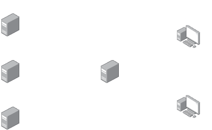
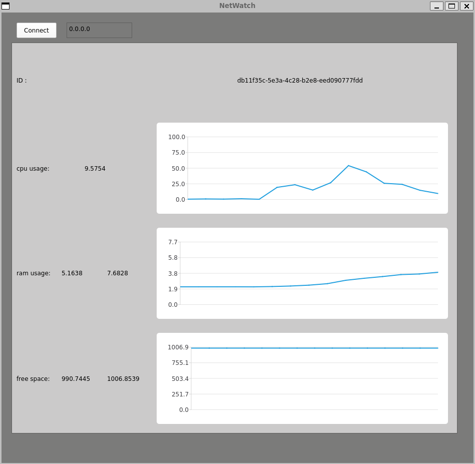

# NetWatch 

A client-server system to allowing to collect the ressources usage (CPU , RAM, Storage) from multiple servers in real time, and to centalise and monitor it from a graphical inteface.

## How does it work ?

### Client
- Collect the ressources data from the server (CPU, RAM, Storage)
- Sends the data to the server

### Server
- Listen the entering TCP connexions on a defined IP and port
- Receive the ressources data sent by the client software running on the servers
- Send the date from all the client to the desktop app

### Desktop app
- Recieve the data collected and centralised by the server.
- Display the evolution of the ressources of each "client" connected to the server  
  

## The desktop app
The user of the desktop app enter the IP adress of the server, then the evolution of the ressources from the clients connected to the server is displayed.
  

